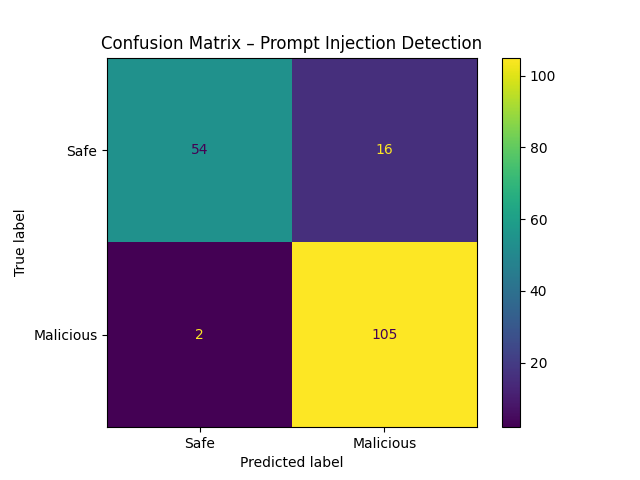

# 🛡️ Prompt Injection Detection


A machine learning–powered system that detects **prompt injection attacks** on LLM-style inputs, combining a **rule-based keyword filter** with a **TF-IDF + classifier ML pipeline**, wrapped in a **Django web application** with a live detection console and a monitoring dashboard.

---

## 📖 Table of Contents
- [Overview](#-overview)
- [Features](#-features)
- [Technology Stack](#-technology-stack)
- [Architecture / Workflow](#-architecture--workflow)
- [Project Structure](#-project-structure)
- [Installation](#-installation)
- [Usage](#-usage)
- [Screenshots](#-screenshots)
- [Web Endpoints](#-web-endpoints)
- [Dataset Information](#-dataset-information)
- [Model Information](#-model-information)
- [Future Improvements](#-future-improvements)
- [Contributing](#-contributing)
- [License](#-license)
- [Author](#-author)

---

## 📌 Overview

**Prompt Injection Detection** is an end-to-end pipeline that classifies user-submitted prompts as **Safe** or **Malicious**, aimed at protecting LLM-based applications from prompt injection attacks (e.g. "ignore previous instructions", credential/password extraction attempts, instruction overrides, etc.).

The project covers the full ML lifecycle — data cleaning, feature extraction, model training/evaluation, and a two-layer detection engine (rule-based + ML-based) — and exposes it through a Django web UI where prompts can be tested live and logged results can be reviewed on a dashboard.

---

## ✨ Features

- **Two-layer detection engine**
  - **Rule-based layer**: instantly blocks prompts containing forbidden keywords/phrases (e.g. `ignore previous`, `override instructions`, `password`, `sudo`, `drop table`, `bypass`, etc.).
  - **ML-based layer**: a trained classifier scores the prompt using TF-IDF features, blocking it if the predicted label is malicious **and** confidence is above a threshold (`0.75`).
- **Text preprocessing pipeline**: deduplication, whitespace normalization, punctuation/special character removal, lowercasing, tokenization, and stop-word removal.
- **TF-IDF feature extraction** with unigrams + bigrams (`ngram_range=(1,2)`, `max_features=5000`).
- **Model comparison** between Logistic Regression and Random Forest, with automatic selection of the best model by F1-score.
- **Model evaluation** with accuracy, precision, recall, F1-score, a full classification report, and a saved confusion matrix image.
- **Command-line testing tool** (`predict.py`) for interactive prompt testing in the terminal.
- **Django web application**
  - `/` — Live "Secure AI Chat" style detection console (`detect.html`) to submit prompts and see BLOCKED/ALLOWED results in real time.
  - `/analyze/` — Backend endpoint that runs the rule-based + ML detection logic and returns a JSON verdict.
  - `/dashboard/` — Monitoring dashboard (`index.html`) listing all logged prompts with their detection type, status, and confidence.
- **Persistent logging**: every analyzed prompt (rule-based or ML-based, safe or blocked) is saved to the database via the `PromptLog` model, including detection type, status, confidence, and timestamp.
- **System testing results**: a curated set of "Known Attacks", "New Attacks", and "Normal Prompts" test cases with recorded predictions and confidence scores (`results/system_testing_results.csv`).

---

## 🧰 Technology Stack

| Category            | Technology |
|---------------------|------------|
| Language             | Python 3 |
| Web Framework        | Django 4.2 |
| Machine Learning     | scikit-learn (Logistic Regression, Random Forest, TF-IDF) |
| Data Handling        | pandas |
| Model Persistence    | joblib, pickle |
| Visualization        | matplotlib |
| Database             | SQLite (`db.sqlite3`) |
| Frontend             | HTML, CSS, Bootstrap, Chart.js, vanilla JavaScript |

---

## 🏗️ Architecture / Workflow

```
                ┌─────────────────────┐
                │  prompt_dataset.csv │
                └──────────┬──────────┘
                           │  preprocessing.py
                           │  (clean, tokenize, remove stopwords)
                           ▼
                ┌─────────────────────┐
                │ dataset_cleaned.csv │
                └──────────┬──────────┘
                           │  feature_extraction.py
                           │  (TF-IDF vectorizer, train/test split)
                           ▼
              ┌────────────────────────────┐
              │  tfidf_vectorizer.pkl      │
              │  X_train_tfidf / X_test_tfidf │
              └──────────┬─────────────────┘
                         │  train_model.py
                         │  (Logistic Regression vs Random Forest)
                         ▼
                ┌─────────────────────┐
                │ classifier_model.pkl│ (best model by F1-score)
                └──────────┬──────────┘
                           │  model_evaluation.py
                           ▼
              results/ (metrics.txt, confusion_matrix.png)

                     ── Inference Time ──
User Prompt ──▶ security_layer() / analyze() view
                     │
        ┌────────────┴─────────────┐
        ▼                          ▼
 Rule-based keyword check   ML prediction (TF-IDF → classifier)
        │                          │
        └────────────┬─────────────┘
                      ▼
           BLOCKED ❌ / ALLOWED ✅
                      │
                      ▼
        Logged to PromptLog (Django DB)
                      │
                      ▼
         Displayed on Dashboard (index.html)
```

---

## 📁 Project Structure

```
Prompt-Injection-Detection/
├── data/
│   ├── prompt_dataset.csv          # Raw labeled prompt dataset
│   └── dataset_cleaned.csv         # Cleaned dataset after preprocessing
├── models/
│   ├── tfidf_vectorizer.pkl        # Fitted TF-IDF vectorizer
│   ├── X_train_tfidf.pkl           # Cached TF-IDF training features
│   ├── X_test_tfidf.pkl            # Cached TF-IDF test features
│   └── classifier_model.pkl        # Best trained classifier
├── results/
│   ├── evaluation_metrics.txt      # Accuracy/Precision/Recall/F1 + report
│   ├── confusion_matrix.png        # Confusion matrix visualization
│   └── system_testing_results.csv  # Manual test-case results
├── src/
│   ├── preprocessing.py            # Cleans raw dataset
│   ├── feature_extraction.py       # Builds TF-IDF features
│   ├── train_model.py              # Trains & selects best model
│   ├── model_evaluation.py         # Evaluates saved model
│   ├── predict.py                  # CLI tool with rule + ML detection
│   └── test_system.py              # (reserved for automated testing)
├── django_ui/
│   ├── manage.py
│   ├── db.sqlite3
│   ├── django_ui/                  # Django project settings/urls
│   └── detection/                  # Django app
│       ├── views.py                # detect_page, analyze, dashboard_page
│       ├── urls.py
│       ├── models.py                # PromptLog model
│       ├── templates/
│       │   ├── detect.html          # Live detection console UI
│       │   └── index.html           # Monitoring dashboard UI
│       └── static/assets/           # CSS, JS, fonts, images
└── README.md
```

---

## ⚙️ Installation

### Prerequisites
- Python 3.10+
- `pip`

### Steps

```bash
# 1. Clone the repository
git clone https://github.com/Rasika28-cs/-Prompt-Injection-Detection.git
cd Prompt-Injection-Detection

# 2. Create and activate a virtual environment
python -m venv venv
source venv/bin/activate      # On Windows: venv\Scripts\activate

# 3. Install dependencies
pip install pandas scikit-learn joblib matplotlib django
```

> **Note:** No `requirements.txt` was found in the project. The command above installs the libraries directly imported by the source code.

---

## 🚀 Usage

### 1. Rebuild the ML pipeline (optional — pre-trained artifacts already exist in `models/`)

```bash
# Clean the raw dataset
python src/preprocessing.py

# Extract TF-IDF features
python src/feature_extraction.py

# Train Logistic Regression & Random Forest, save the best model
python src/train_model.py

# Evaluate the saved model
python src/model_evaluation.py
```

### 2. Test detection from the command line

```bash
python src/predict.py
```
This launches an interactive prompt where you can type text and immediately see whether it's `✅ ALLOWED` or `❌ BLOCKED`, along with the detection label and confidence score. Type `exit` to quit.

### 3. Run the Django web application

```bash
cd django_ui
python manage.py migrate
python manage.py runserver
```

Then open your browser at:
- `http://127.0.0.1:8000/` — Live detection console
- `http://127.0.0.1:8000/dashboard/` — Prompt monitoring dashboard

---

## 🖼️ Screenshots

> Screenshots are not included in the repository. Add your own images to a `screenshots/` folder and update the paths below.

| Detection Console | Monitoring Dashboard |
|---|---|
|  |  |

| Confusion Matrix |
|---|
|  |

---

## 🔗 Web Endpoints

| Method | Endpoint       | View              | Description |
|--------|----------------|-------------------|--------------|
| GET    | `/`            | `detect_page`     | Renders the live prompt detection console |
| POST   | `/analyze/`    | `analyze`         | Accepts a `prompt` form field, runs rule-based + ML detection, logs the result, and returns a JSON verdict (`status`, `message`) |
| GET    | `/dashboard/`  | `dashboard_page`  | Renders a dashboard listing all logged prompts (newest first) |
| —      | `/admin/`      | Django Admin      | Default Django admin site |

**Example `/analyze/` response:**
```json
{
  "status": "danger",
  "message": "Status : ❌ BLOCKED\nLabel : ML-Detected Malicious Prompt\nConfidence : 0.891"
}
```

---

## 📊 Dataset Information

| File | Rows | Columns | Description |
|------|------|---------|--------------|
| `data/prompt_dataset.csv` | 890 | `prompt_text`, `label` | Raw labeled prompts (1 = malicious/injection, 0 = safe) |
| `data/dataset_cleaned.csv` | 882 | `clean_text`, `label` | Deduplicated, normalized, punctuation-stripped, lowercased, stop-word-removed text |

**Label distribution (cleaned dataset):**

| Label | Meaning | Count |
|-------|---------|-------|
| 1 | Malicious / Prompt Injection | 524 |
| 0 | Safe | 358 |

Preprocessing steps applied (`src/preprocessing.py`):
1. Drop duplicate prompts
2. Strip and normalize whitespace
3. Remove non-alphanumeric characters
4. Lowercase text
5. Tokenize
6. Remove English stop words
7. Rejoin tokens into `clean_text`

---

## 🤖 Model Information

- **Feature extraction:** `TfidfVectorizer` — unigrams + bigrams, `max_features=5000`, English stop words removed.
- **Models trained and compared:**
  - Logistic Regression (`max_iter=1000`)
  - Random Forest (`n_estimators=100`, `random_state=42`)
- **Model selection:** the model with the higher **F1-score** on the held-out test set (80/20 split, `random_state=42`) is saved as `models/classifier_model.pkl`.
- **Inference threshold:** predictions are only classified as malicious if `prediction == 1` **and** `confidence >= 0.75`; otherwise the prompt is allowed.

**Latest evaluation results** (`results/evaluation_metrics.txt`):

| Metric | Score |
|--------|-------|
| Accuracy | 0.8983 |
| Precision | 0.8678 |
| Recall | 0.9813 |
| F1-score | 0.9211 |

**Classification report:**

| Class | Precision | Recall | F1-score | Support |
|-------|-----------|--------|----------|---------|
| 0 (Safe) | 0.96 | 0.77 | 0.86 | 70 |
| 1 (Malicious) | 0.87 | 0.98 | 0.92 | 107 |

A confusion matrix visualization is saved at `results/confusion_matrix.png`.

---

## 🔮 Future Improvements

- Add a `requirements.txt` / `pyproject.toml` for reproducible environment setup.
- Replace the hardcoded `FORBIDDEN_KEYWORDS` list with a configurable, externally managed rules file.
- Add authentication and access control to the dashboard.
- Expand the dataset with more diverse injection patterns and multilingual prompts.
- Implement automated tests inside `src/test_system.py` (currently empty) and add CI.
- Experiment with transformer-based embeddings (e.g. sentence-transformers) instead of TF-IDF for improved recall on subtle prompt injections.
- Add environment-based configuration for `SECRET_KEY`, `DEBUG`, and `ALLOWED_HOSTS` for production deployment.

---

## 🤝 Contributing

Contributions are welcome!

1. Fork the repository
2. Create a feature branch (`git checkout -b feature/your-feature`)
3. Commit your changes (`git commit -m "Add your feature"`)
4. Push to the branch (`git push origin feature/your-feature`)
5. Open a Pull Request

---

## 📄 License

This project is licensed under the **MIT License**. (No `LICENSE` file was found in the repository — add one to formalize this.)

---

## 👤 Author

**Rasika28-cs**
GitHub: [Rasika28-cs](https://github.com/Rasika28-cs)
Repository: [Prompt-Injection-Detection](https://github.com/Rasika28-cs/-Prompt-Injection-Detection)
